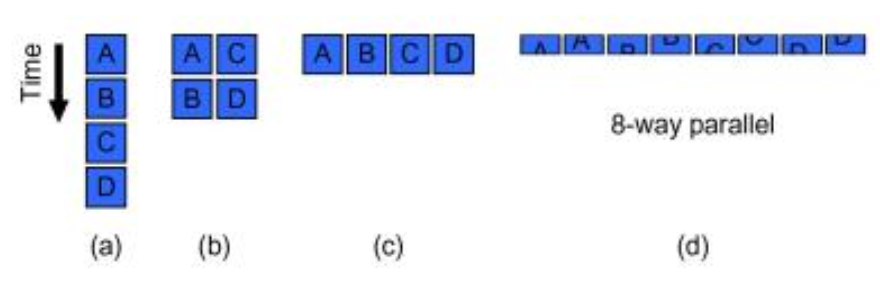
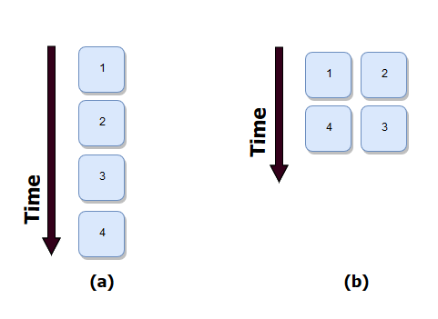
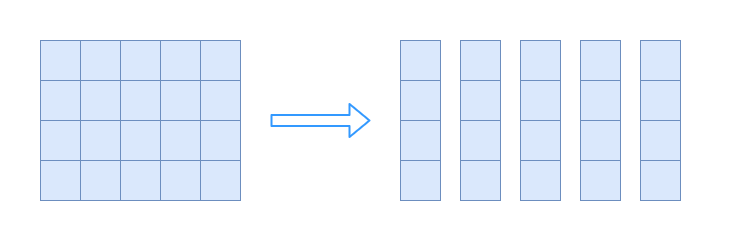
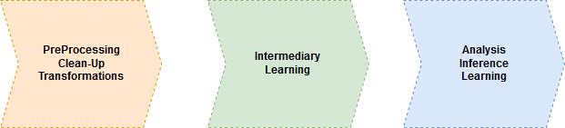

```{r setup, include=FALSE}
knitr::opts_chunk$set(echo = TRUE)
```


## dummy slide
<!--javascript to remove dummy slide-->
<script>document.getElementById("dummy-slide").remove();</script><!--end dummy slide--></section>
<section><section class="titleslide slide level1">
<h1>Parallelisierung</h1>

Definition:

 * Simultane Ausführung von Berechnungen
 * Grundprinzip ist die Unterteilung von Aufgaben


<!--"Everybody who learns concurrency thinks they understand it, ends up finding mysterious races they thought weren’t possible, and discovers that they didn’t actually understand it yet after all." Herb Sutter, chair of the ISO C++ standards committee, Microsoft.


"Debugging is twice as hard as writing the code in the first place. Therefore, if you write the code as cleverly as possible, you are, by definition, not smart enough to debug it." Brian Kernighan, professor at Princeton University.
-->


 > - 
   - Source: Structured Parallel Programming p. 6

## Batch Analyse

Parallelisierung um die Verarbeitung von grösseren Datenmengen zu ermöglichen.

{ width=40% }

Stichwort: Big Data (strukturierte und unstrukturierte Daten)

## Antwortzeit von Abfragen

Parallesierung mit dem Ziel die Antwortzeit (Latenz) eines Systems zu verkürzen.

{ width=40% }

Anwendungen (?):

 > - Suchen, Expertensysteme
 > - Analysen mit Parametern 

</section></section>


<section>
<section class="titleslide slide level1">
<h1>Skalierung</h1>

Skalierung über:

 * grosse Mengen an Daten
 * grosse Anzahl von Nutzern
 * variable Anfragefrequenz

## Daten Skalierung

 * Text (Web, Enterprise)
 * Sensor (Herstellung, Maschinen, Fahrzeuge)
 * Medizinische Daten (Patientendaten, Ally Science)
 * Bilddaten (Satellitendaten, Drohnen)
 
 Grosse Mengen nützlicher Informationen in Daten enthalten.

## Nutzer Skalierung

 * Enterprise (Unterstützung von Analysten und Support)
 * Verkauf (Analyse von Online-Shopping)
 * Endnutzer (Analyse Nutzerverhalten)
 * Maschinelles Lernen als Service (Siri, Alexa)
 
 Wachsende Anzahl an Nutzergruppen die von Datenanalyse profitieren.

## Variable Anfragefrequenz


</section></section>

<section>
<section class="titleslide slide level1">
<h1>Ansätze zur Parallelisierung</h1>

## Zerlegung [Decomposition]

Zerlegung der Aufgabe [Task] in einzelne Teil-Aufgaben und / oder Partitionierung der Daten.


> 1. Einzelne Arbeitsschritte erfassen: Was muss getan werden?
> 2. Daten erfassen: Welche Daten und wie "sehen" sie aus?
> 3. Arbeitsschritte in Aufgaben zusammenfassen
> 4. Partitionierung von Daten festlegen
 


## Zerlegung: Unterteilung in Tasks

* Default: Alle Arbeitsschritte als einen Task definieren


* Oftmals keine eindeutige Lösung

## Zerlegung: Daten Partitionierung


{ width=60% }

 * Dokumente versus Berechnungen 
 * Integer Intervalle zur Berechnung von Primzahlen
 * Faire / gleichmässige Verteilung ?

## Abhängigkeiten

Stichworte: Abstimmung (Synchronisierung von Abläufen), Kommunikation

1. Ist Kommunikation zwischen Threads nötig um einen Task zu lösen?
2. Sind Tasks abhängig von der Verfügbarkeit der Ergebnisse früherer Tasks?

## Abhängigkeiten ?

Task: Transformation von Bildern.

{ width=35% }

> - Keine Abhängigkeiten (embarrassingly parallel, perfectly parallel)
> - 350+ Millionen Fotos pro Tag (2013) [Facebook](https://www.facebook.com/notes/facebook/facebook-photos-infrastructure/2406207130)

## Abhängigkeiten

 * Shared State, interleave
 * Lesen, Schreiben, Löschen

Präferenz aus Sicht der Parallelisierung: 
 
> 1. Lesen ohne Veränderung [Immutable]
> 2. Lesen mit Veränderung [Mutable]
> 3. Schreiben, Löschen

Toolbox:
 
> * synchronized methods 
> * wait, notifyAll methods of class Object 
 

## Design der Parallelisierung

 * Input: Tasks, Daten, Threads
 * Aufgabe: Verteilung der Tasks und Daten auf Threads
 

## Design der Parallelisierung

 { width=65% }

Beispiele: Image Transformation, Count prime numbers in range

## Rezept für Parallelisierung

> 1. Task Analyse (Was muss getan werden?)
> 2. Daten Partitionierung (Wie lassen sich die Daten verteilen?)
> 3. Analyse der Abhängigkeiten (Kommunikation, Synchronisation notwendig? Geht es ohne?)
> 4. Design Parallelisierung (Verteilung von Tasks und Daten auf Threads)


<!--
## Performanz

Thread Pools
Fixed Thread Pools
Char Parallelisation
Calculation between
task length, amdahls law

!!! Abwägung zwischen Nachvollziehbarkeit, Komplexität
-->

</section></section>


<section>
<section class="titleslide slide level1">
<h1>Fallbeispiel: Contract Intelligence</h1>
* Verarbeitung von Verträgen sehr häufig bei Banken
* Z.b. Einpflegen des Inhalts der Verträge in Systeme
* Aufgabe wird oft vollständig manuell verrrichtet
* Grosses Interesse der Banken in Bezug auf Automatisierung

## Credit Agreement


## Aufgabenstellungen

 * Extraktion und Einpflegen von Werten
     + Datum der Gültigkeit, Datum des Verfalls
     + Präsenz bestimmter Klauseln und Bedingungen
 * Suche in Verträgen
 * Vertragslänge 100-800 Seiten
 
Anwendung von Datenanalyse zur Effizienzsteigerung. 


<!-- ## Maschinelles Lernen in Phasen




-->

 
## Erlernen der Ähnlichkeit von Konzepten


 * Automatisches Erlernen von Synonymen (Suche)
 * Ähnlichkeit und Beziehungen zwischen Konzepten erkennen

## Erlernen der Ähnlichkeit von Konzepten

> You shall know a word by the company it keeps (Firth, John R. 1957)

Lernen basierend auf Verteilung von Wörtern:

 * Gemeinsames Vorkommen [co-occurrence]
 * Kontext: Dokument, Paragraph, Satz


## Erlernen der Ähnlichkeit von Konzepten

 Berechnung der Ähnlichkeit:

  * Pointwise Mutual Information (PMI)
  * Gewichtet das gemeinsame Vorkommen von Wörtern
  * Der, die, das kommen sehr häufig mit anderen Wörtern vor.
 
  
 
## Erlernen der Ähnlichkeit von Konzepten

Pointwise Mutual Information (PMI)

 \[
 log_{2}\frac{\frac{count(xy)}{countAll}}{\frac{count(x) x count(y)}{countAll}}
 \]

Wir benötigen: count(xy), countAll, count(x), count(y)

</section>
</section>


<section>
<section class="titleslide slide level1">
<h1>Umsetzung</h1>

## Arbeitsschritte identifizieren

Ausgangspunkt: Satz von "Credit Agreement"s in Form von HTML Files (Source: sec.gov)


 
> 1. HTML Files laden
> 2. Text extrahieren
> 3. Text in Wörter zerteilen [Tokenisation]
> 4. Zählen der Ereignisse
> 5. Berechnung PMI basierend auf Zählungen von **allen** Dokumenten


## Tasks definieren

Einfach starten : Arbeitsschritte 1-4 stellen einen Task dar

## Daten Partitionieren

(?)

## Design Parallelisierung

(?)

## Umsetzung in Code (?)

## Umsetzung in Code

```{Java}
public class DocumentProcessor implements Runnable {

  private File document;
  private InMemFreqCounts freqCounts;

  public DocumentProcessor(File document, InMemFreqCounts freqCts) {
    this.document = document;
    this.freqCounts = freqCts;
  }

  public void run() {
    String fileContent = getFileContent(document);
    String documentText = extractText(fileContent);
    List<String> documentTokens = getTokens(documentText);
    freqCounts.addObservations(documentTokens, false);
}
...
```
## Thread Klasse

Alle Dokumente müssen verarbeitet sein bevor wir die Ähnlichkeiten berechnen.

* Warten auf alle Threads?
* Skalierung zu N Dokumenten bedeutet N Threads?

## ExecutorService

```{Java}
public class RunAssociationLearning {
    
  public static void main(String[] args) 
    throws IOException, ClassNotFoundException {
      
    InMemFreqCounts freqCounts = new InMemFreqCounts();
    ExecutorService executor = Executors.newFixedThreadPool(20);
    File[] files = getFiles(new File("./src/main/resources/html"));
    for (File file : files) {
        executor.execute(new DocumentProcessor(file, freqCounts));
    }

    executor.shutdown();
    try {
      executor.awaitTermination(1000, TimeUnit.SECONDS);
    } catch (InterruptedException ex) { ... }
```

 *  Executors.newFixedThreadPool
 *  Executors.newCachedThreadPool
 *  Executors.newSingleThreadExecutor
 
## Ergebnisse

Synonyme Credit Agreements 

 maturity-date | termination-date
 ---------------|-------------
 term-loan-maturity-date|revolving-termination-date
 stated-maturity-date|commitment-termination-date
 revolving-credit-maturity-date |maturity-date


## Optimierung I

Ideen zur Optimierung?

Wie stellen wir sicher dass richtig gezählt wird (Shared Object)?


## Synchronisierung


```{Java}
/**
* Add observations of tokenized terms seen in a context.
*
* @param terms the tokenised terms
*/
public synchronized void addObservations(List<String> terms) {
  updateDFCounts(terms);
  updateCoOcCounts(terms);
}
```

Was sind potentielle Nachteile dieses Vorgehens?

## Concurrent Collections, Atomic 

Alternative zur Nutzung von **synchronized**

```{Java}
/**
* Constructor initialises all count storage.
*/
public InMemFreqCounts() {
  coOccMap = new ConcurrentHashMap<Long, Integer>();
  totalContextsSeen = new AtomicInteger(); 
}
```

Vorteile:

 * Geschwindigkeit
 * Fehleranfälligkeit

Packages:

 * java.util.concurrent.atomic
 * java.util.concurrent für Collection classes

## Ergebnisse II

Crawled 2831 HTML Seiten auf der sub-domain ti.bfh.ch.

it-services	| PMI Score | 3d-druck | PMI Score
---------------|------------- |------------|------------
it-infrastruktur|	197.7 | bfh-hkb |	191.7
informatikdienste	|194.6 | wachs |	189.7
professionellen|	185.4 | beschichtungen |	181.7
betreiben	|178.4 | formteilen |	171.7    

_______

Ohne Filterung nach Sprache.

room	| PMI Score | (debian) | PMI Score
---------------|------------- |------------|------------
clean | 200.0	| 	apache/2 | 198.0		
devices	| 182.0 | url	| 197.2
efficiency | 173.7 | 443 |	182.5
production | 166.8 | port | 176.7

automne	 | PMI Score | génie | PMI Score
---------------|------------- |------------|------------
série	| 189.7 | électrique | 190.1 7	
l’année	| 187.0 | 	techniques |	172.3
présente | 183.3 | dans	| 156.9
année	| 182.7 | un |	156.1

## Optimierung II 

 * Bottlenecks
    + Hardware-Abhängigkeiten (IO, Network)
    + Synchronisierung
 * Abstimmung wenn Tasks über mehrere Threadpools verteilt werden
 * Komplexität des Systems
     + Nachvollziehbarkeit von Vorteil
     + Externe Abhängigkeiten (Libraries, Team, Kundensysteme)
 

## Anregungen

> "Debugging is twice as hard as writing the code in the first place. Therefore, if you write the code as cleverly as possible, you are, by definition, not smart enough to debug it." Brian Kernighan, professor at Princeton University

> "Everybody who learns concurrency thinks they understand it, ends up finding mysterious races they thought weren’t possible, and discovers that they didn’t actually understand it yet after all." Herb Sutter, chair of the ISO C++ standards committee, Microsoft.